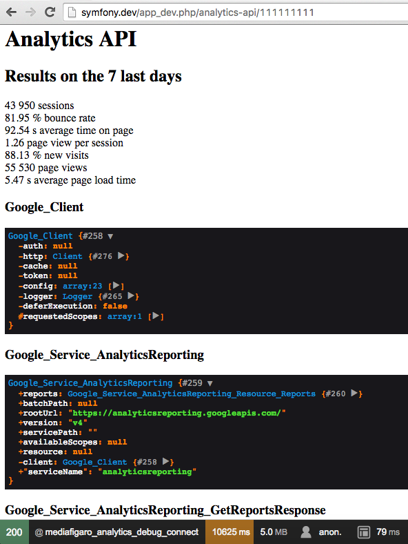

Google Analytics API v4 Symfony bundle
======================================

# Use

At MEDIA.figaro http://media.figaro.fr, the advertising department of the french newspaper Le Figaro and part of the Figaro Group (CCM Benchmark), we use this bundle to monitor our digital platforms with Google Analytics. 

It's a simple package that wraps the Google Analytics API version 4, and that gives you all the information to go straight to the point of getting some main metrics from GA.

To be able to use it, you have to setup a project on Google Console for Google Analytics, get the json key, then configure this package by setting the path for it. You'll have to add the developer email defined into the Google Console to the GA views to authorize it, otherwise the view won't be accessible through the API. 

You can use the debug routes to go live and test a profile (ex id : 111111111, here with [Docker](https://github.com/mediafigaro/docker-symfony)) :

http://symfony.dev/app_dev.php/analytics-api/111111111 

# Installation

    composer require mediafigaro/google-analytics-api-symfony
    
without Flex, add to /app/AppKernel.php :

    $bundles = [
        ...
        new MediaFigaro\GoogleAnalyticsApi\GoogleAnalyticsApi(),
    ];

# Versions

## 1.2

Adding filterMetric and filterDimension to getDataDateRangeMetricsDimensions method which is a simple wrapper to Google Api Client ex :

    $analyticsService = $this->get('google_analytics_api.api');

    $data = $analyticsService->getDataDateRangeMetricsDimensions(
        'myanalyticsviewid',    // viewid
        '2018-01-01',   // date start
        'today',        // date end
        ['sessions','users','percentNewSessions','bounceRate'],             // metric
        ['source','campaign','fullReferrer','sourceMedium','pagePath'],     // dimension
        [   // order metric and/or dimension
            'fields'    =>  ['sessions'],
            'order'     =>  'descending'
        ],
        [   // metric
            'metric_name'       =>  'sessions',
            'operator'          =>  'LESS_THAN',
            'comparison_value'  =>  '100'
        ],
        [   // dimension
            'dimension_name'    =>  'sourceMedium',
            'operator'          =>  'EXACT',
            'expressions'       =>  [
                'trading / native'
            ]
        ]
    );

## 1.1

Symfony 4 simple adaptation with a public service and a new public method that takes in charge metrics and dimensions with sorting options :

    getDataDateRangeMetricsDimensions($viewId,$dateStart,$dateEnd,$metrics='sessions',$dimensions=null,$sorting=null)

Query explorer https://ga-dev-tools.appspot.com/query-explorer/ to build your query.

$viewId : https://developers.google.com/analytics/devguides/reporting/core/v3/reference#ids

$dateStart : https://developers.google.com/analytics/devguides/reporting/core/v3/reference#startDate

$dateEnd: https://developers.google.com/analytics/devguides/reporting/core/v3/reference#endDate

$metrics: https://developers.google.com/analytics/devguides/reporting/core/v3/reference#metrics (without the 'ga:', array or string)

$dimensions: https://developers.google.com/analytics/devguides/reporting/core/v3/reference#dimensions (without the 'ga:', array or string)

$sorting: https://developers.google.com/analytics/devguides/reporting/core/v3/reference#sort
 
without the 'ga:', array or string, eg. :

    [
        'fields'    =>  ['pagePath','sessions'], // or : 'sessions'
        'order'     =>  'descending'
    ]

example :

    $analyticsService = $this->get('google_analytics_api.api');
    
    $data = $analyticsService->getDataDateRangeMetricsDimensions(
        'myanalyticsviewid',
        '30daysAgo',
        'today',
        ['sessions','users','percentNewSessions','bounceRate'],
        ['source','campaign','fullReferrer','sourceMedium','pagePath'],
        [
            'fields'    =>  ['pagePath','sessions'],
            'order'     =>  'descending'
        ]
    )

$data :

    array(329) {
      [0]=>
      array(2) {
        ["metrics"]=>
        array(4) {
          ["sessions"]=>
          string(5) "16738"
          ["users"]=>
          string(5) "15602"
          ["percentNewSessions"]=>
          string(17) "88.39168359421676"
          ["bounceRate"]=>
          string(17) "83.95268251881946"
        }
        ["dimensions"]=>
        array(5) {
          ["source"]=>
          string(7) "trading"
          ["campaign"]=>
          string(7) "my-campaign"
          ["fullReferrer"]=>
          string(7) "trading"
          ["sourceMedium"]=>
          string(16) "trading / native"
          ["pagePath"]=>
          string(50) "/my-url"
        }
      }
      [1]=>
      array(2) {
        ["metrics"]=>
        array(4) {
          ["sessions"]=>
          string(4) "6506"
          ["users"]=>
          string(4) "6200"
          ["percentNewSessions"]=>
          string(17) "87.05810021518599"
          ["bounceRate"]=>
          string(17) "87.74976944359054"
        }
        ["dimensions"]=>
        array(5) {
          ["source"]=>
          string(7) "trading"
          ["campaign"]=>
          string(7) "my-campaign-2"
          ["fullReferrer"]=>
          string(7) "trading"
          ["sourceMedium"]=>
          string(19) "trading / 320x480-1"
          ["pagePath"]=>
          string(50) "/my-url-2"
        }
      }
      [2]=>
      ...

**Session - Dimensions & Metrics Explorer** : https://developers.google.com/analytics/devguides/reporting/core/dimsmets

## 1.0

First version with a quick connector to consume Google Analytics v4 with Google API client with getDataDateRange private method (that handles only metrics), wrapped with some public methods to get a quick access to main metrics such as sessions (eg. getBounceRateDateRange($viewId,$dateStart,$dateEnd)), bounce rate, average time on page, page view per session, new visits, page views and average page load time.
Debug route included for a simple setup and test.

# Configuration

    google_analytics_api.google_analytics_json_key

Set the relative path for your json key (set it on your server, better not into your repository) from execution path, ex: /data/analytics/analytics-27cef1a4c0fd.json.

/app/config/parameters.yml

    google_analytics_json_key: "../data/analytics/analytics-27cef1a4c0fd.json"

/app/config/config.yml

    google_analytics_api:
        google_analytics_json_key: "%google_analytics_json_key%"
        
# Google API key

Generate the json file from https://console.developers.google.com/start/api?id=analyticsreporting.googleapis.com&credential=client_key by creating a project, check the documentation : https://developers.google.com/analytics/devguides/reporting/core/v4/quickstart/service-php.

# Google Analytics API v4

List of metrics for report building with search engine : https://developers.google.com/analytics/devguides/reporting/core/dimsmets eg. ga:sessions, ga:visits, ga:bounceRate ...

Objects : https://github.com/google/google-api-php-client-services/tree/master/AnalyticsReporting

(example : ReportData object : https://github.com/google/google-api-php-client-services/blob/master/AnalyticsReporting/ReportData.php)

Samples : https://developers.google.com/analytics/devguides/reporting/core/v4/samples

# Debug

Add the debug routes for development purposes :

/app/config/routing_dev.yml

    _google_analytics_api:
        resource: "@GoogleAnalyticsApi/Resources/config/routing_dev.yml"

http://symfony.dev/app_dev.php/analytics-api/000000000 

000000000 = profile id that you can find in the analytics URL, p000000000 :

https://analytics.google.com/analytics/web/?hl=en&pli=1#management/Settings/a222222222w1111111111p000000000/%3Fm.page%3DPropertySettings/

Result of this debug page :

# Errors

In that 403 error case, follow the link and authorize the API v4.

    ...
        "message": "Google Analytics Reporting API has not been used in project xxxxxx-xxxxxx-000000 
        before or it is disabled. Enable it by visiting 
        https://console.developers.google.com/apis/api/analyticsreporting.googleapis.com/overview?project=xxxxxx-xxxxxx-000000 
        then retry. If you enabled this API recently, wait a few minutes for the action to propagate 
        to our systems and retry.",
        "domain": "global",
        "reason": "forbidden"
    }
    ],
    "status": "PERMISSION_DENIED"

# Example

Call the service :

    $analyticsService = $this->get('google_analytics_api.api');
    $analytics = $analyticsService->getAnalytics();
    
Use the method helpers to get the main metrics within a date range :
    
    $viewId = '000000000'; // set your view id
    
    // get some metrics (last 30 days, date format is yyyy-mm-dd)
    $sessions = $analyticsService->getSessionsDateRange($viewId,'30daysAgo','today');
    $bounceRate = $analyticsService->getBounceRateDateRange($viewId,'30daysAgo','today');
    $avgTimeOnPage = $analyticsService->getAvgTimeOnPageDateRange($viewId,'30daysAgo','today');
    $pageViewsPerSession = $analyticsService->getPageviewsPerSessionDateRange($viewId,'30daysAgo','today');
    $percentNewVisits = $analyticsService->getPercentNewVisitsDateRange($viewId,'30daysAgo','today');
    $pageViews = $analyticsService->getPageViewsDateRange($viewId,'30daysAgo','today');
    $avgPageLoadTime = $analyticsService->getAvgPageLoadTimeDateRange($viewId,'30daysAgo','today');

# Contribution

You are welcome to contribute to this small Google Analytics v4 wrapper, to create more helpers or more.

# More tools

Try the Symfony Debug Toolbar Git : https://github.com/kendrick-k/symfony-debug-toolbar-git and the docker Service Oriented Architecture for Symfony : https://github.com/mediafigaro/docker-symfony.

# Tutorial

French [tutorial](https://www.supinfo.com/articles/single/2423-symfony-27-integration-google-analytics) by Jérémy PERCHE, SUPINFO student.
